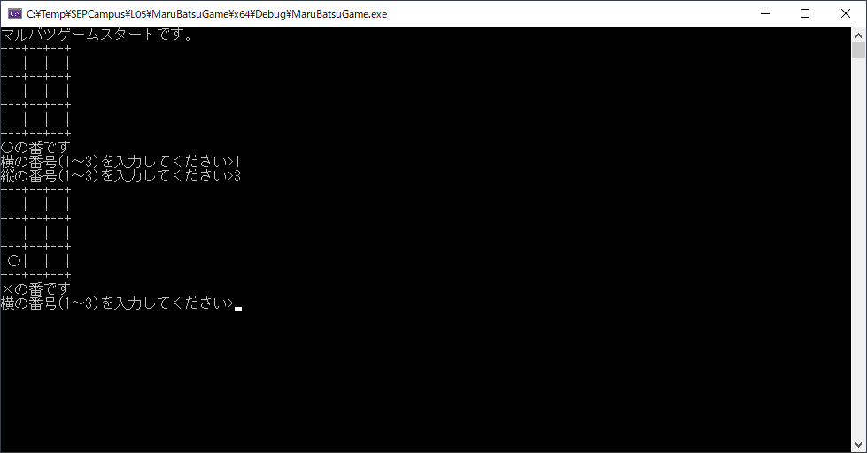

# マルバツゲーム
<div style="text-align: right;">
2019年12月5日<br>
株式会社アルファオメガ  松本清明
</div>


## マルバツゲームのサンプルを作ってみました。
自分もマルバツゲームをコマンドプロンプト版で作ってみました。
出来たゲーム画面は以下のような感じです。


## 制作で問題点となったところ

### 盤面選択で数字以外を入力した時の処理

縦横で盤面を選択する時に数字を入力しますが、数字以外を選んだあと
scanf_s関数が入力できなくなったので、以下の関数を挟むようにしました。
皆さんどうですか？
```c
rewind(stdin);
```

### 罫線文字列の表示がおかしくなる

```c
┌─┬─┬─┐
│　│　│　│
├─┼─┼─┤
│　│　│　│
├─┼─┼─┤;
│　│　│　│
└─┴─┴─┘
```
まあこんな感じに罫線がそろわなく盤面を奇麗に作れませんでした。
いったん半角の文字で枠を作って回避してしまいました。
皆さんはどのように回避しました？


## マルバツゲームのサンプルプログラム
自分が作るのであればこのような感じに作りますというサンプルプログラムを作りました。
どのように作ればよいか悩んでいた場合は参考にしてみてください。

```c
#include <iostream>
#include <cstdio>

enum class KindType
{
	Blank,	// 0:何もない
	Maru,	// 1:〇
	Batsu,	// 2:×
};
enum class ResultType
{
	Undecided,	// 0: 勝敗は決まっていない
	WinMaru,	// 1: 〇が勝ち
	WinBatsu,	// 2: ×が勝ち
	DrawGame,	// 3: 引き分け
};

static const int glidSize = 3;

//┌─┬─┬─┬─┬─┬─┬─┬─┐
//│b7│b6│b5│b4│b3│b2│b1│b0│
//├─┼─┼─┼─┼─┼─┼─┼─┤
//│　│　│　│　│　│　│×│〇│
//└─┴─┴─┴─┴─┴─┴─┴─┘
static KindType glid[glidSize][glidSize];

static int gamePhase;

// 関数定義
static void SelectGlid();
static bool CheckInputData(int x, int y);
static ResultType CheckGameResult();
static void DrawBoard();
static bool DrawResult(ResultType rType);

int main()
{
	gamePhase = 0;
	memset(glid, 0, sizeof(glid));

	bool exitFlag = false;
	printf_s("マルバツゲームスタートです。\n");
	while (exitFlag == false)
	{
		DrawBoard();
		ResultType rType;
		rType = CheckGameResult();
		DrawResult(rType);
		if (rType == ResultType::Undecided)
		{
			SelectGlid();
		}
		else
		{
			exitFlag = true;
		}
	}
	printf_s("マルバツゲームを終了します。\n");
}

static void SelectGlid()
{
	int x = 0, y = 0;
	printf_s("横の番号(1～3)を入力してください>");
	scanf_s("%d", &x);
	printf_s("縦の番号(1～3)を入力してください>");
	scanf_s("%d", &y);

	x--;y--;
	if (CheckInputData(x, y))
	{
		KindType kind;
		if ((gamePhase & 1) == 0)
		{
			kind = KindType::Maru;
		}
		else
		{
			kind = KindType::Batsu;
		}
		glid[y][x] = kind;
		gamePhase++;
	}
	// 数字ではなくそのほかの文字を入力した時のエラー処理
	rewind(stdin);
}

static ResultType ConvertGameResult(int data)
{
	switch (data)
	{
	case 1:
		return ResultType::WinMaru;
	case 2:
		return ResultType::WinBatsu;
	}
	return ResultType::Undecided;
}

// 0: 勝敗は決まっていない
// 1: 〇が勝ち
// 2: ×が勝ち
// 3: 引き分け
static ResultType CheckGameResult()
{
	// 行確認
	for (int y = 0; y < glidSize; y++)
	{
		int result = 3;
		for (int x = 0; x < glidSize; x++)
		{
			result &= static_cast<int>(glid[y][x]);
		}
		if (result != 0) return ConvertGameResult(result);
	}

	// 列確認
	for (int x = 0; x < glidSize; x++)
	{
		int result = 3;
		for (int y = 0; y < glidSize; y++)
		{
			result &= static_cast<int>(glid[y][x]);
		}
		if (result != 0) return ConvertGameResult(result);
	}

	// 左上から右下の線
	{
		int result = 3;
		for (int i = 0; i < glidSize; i++)
		{
			result &= static_cast<int>(glid[i][i]);
		}
		if (result != 0) return ConvertGameResult(result);
	}

	// 左下から右上の線
	{
		int result = 3;
		for (int i = 0; i < glidSize; i++)
		{
			result &= static_cast<int>(glid[glidSize - i - 1][i]);
		}
		if (result != 0) return ConvertGameResult(result);
	}

	// 勝敗は決まっていない
	for (int j = 0; j < glidSize; j++)
	{
		for (int i = 0; i < glidSize; i++)
		{
			if (glid[j][i] == KindType::Blank) return ResultType::Undecided;
		}
	}

	// 引き分け
	return ResultType::DrawGame;
}


static bool CheckInputData(int x, int y)
{
	if (!(x>=0 && x<glidSize))
	{
		printf_s("Xの範囲が間違っています\n");
		return false;
	}
	else if (!(y >= 0 && y < glidSize))
	{
		printf_s("Yの範囲が間違っています\n");
		return false;
	}
	else if (glid[y][x] != KindType::Blank)
	{
		printf_s("選ぶことが出来ません\n");
		return false;
	}
	return true;
}

static void DrawBoard()
{
	for (int y = 0; y < glidSize; y++)
	{
		puts("+--+--+--+");
		for (int x = 0; x < glidSize; x++)
		{
			const char* pieceMark;
			switch (glid[y][x])
			{
			case KindType::Maru:
				pieceMark = "〇";
				break;
			case KindType::Batsu:
				pieceMark = "×";
				break;
			default:
				pieceMark = "　";
				break;
			}
			printf_s("|%s", pieceMark);
		}
		puts("|");
	}
	puts("+--+--+--+");
}

static bool DrawResult(ResultType rType)
{
	bool result = false;
	switch (rType)
	{
	case ResultType::Undecided:
		if ((gamePhase & 1) == 0)
		{
			printf_s("〇の番です\n");
		}
		else
		{
			printf_s("×の番です\n");
		}
		break;
	case ResultType::WinMaru:
		printf_s("〇が勝ちました。\n");
		result = true;
		break;

	case ResultType::WinBatsu:
		printf_s("×が勝ちました。\n");
		result = true;
		break;

	case ResultType::DrawGame:
		printf_s("引き分けでした。\n");
		result = true;
		break;
	}
	return result;
}
```
[MaruBatsuGame/MaruBatsuGame.cpp](MaruBatsuGame/MaruBatsuGame.cpp)


[プロジェクトごとコミットしている](MaruBatsuGame/)ので参考にしてみてください。
