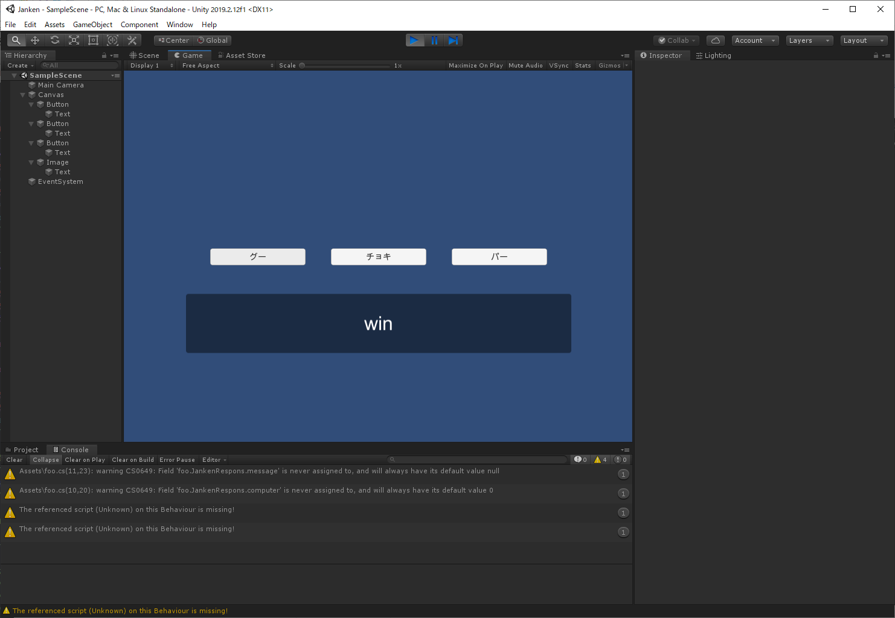

# じゃんけんを作る
<div style="text-align: right;">
2019年12月16日<br>
株式会社アルファオメガ  松本清明
</div>

# はじめに
サーバーとクライアントの連携したプログラムの例としてじゃんけんを作ってみましょう。
サーバーサイドは簡単なプログラムを用意したので、設定方法とプログラムを載せておきます。


# サーバーの用意

## Amazon ユーザーアカウント作成
AWSのユーザーアカウント登録を済ませておいて下さい。

## Amazon EC2のインスタンスを作成
具体的な設定方法は別の機会に書きますが、まずはクラウド上にサーバーを立ち上げます。

## Amazon EC2にSSH接続

Windows10の場合
SSHクライアントを利用するのが良いと思います。自分は [RLogin](http://nanno.dip.jp/softlib/man/rlogin/)を利用しています。

Macなどその他の場合
``` bash
$ ssh -i ~/.ssh/秘密鍵名.pem ユーザ名@パブリックDNS
```

## OSを最新に更新
``` bash
$ sudo yum update -y
```
## nginxの設定

### nginxをインストール
``` bash
$ sudo amazon-linux-extras install nginx1.12
$ nginx -v
nginx version: nginx/1.12.2
```
### nginx自動起動設定
``` bash
$ sudo systemctl start nginx.service
$ sudo systemctl enable nginx.service
$ systemctl status nginx.service
```

## PHP7.3の設定

### PHP7.3をインストール
``` bash
$ sudo amazon-linux-extras install php7.3 php-fpm
$ php-fpm -v
```

### PHP自動起動設定
``` bash
$ sudo systemctl start php-fpm.service
$ sudo systemctl enable php-fpm.service
$ systemctl status php-fpm.service
```

### Elastic IPの割り当て
通常は起動のたびに毎回IPアドレスが変わってしまいますが、Elastic IPを使用すると静的に決めた
IPv4 アドレスを使用することが出来ます。

設定方法はまた別の機会に書きます。

### Elastic IP アドレスを実行中のインスタンスに関連付ける
設定方法はまた別の機会に書きます。

現状はこのIPアドレスにしました。今後変変わる可能性があります。

|||
|--:|:--|
|IPアドレス|18.176.58.134|
|ドメイン名|ec2-18-176-58-134.ap-northeast-1.compute.amazonaws.com|


## 各種ファイルの準備

## index.html
```html
<!DOCTYPE html>
<html lang="ja">
<head>
  <meta charset="utf-8">
  <title>シンプルHTML</title>
</head>
<body>
こんにちは
</body>
```
http://ec2-18-176-58-134.ap-northeast-1.compute.amazonaws.com/index.html

### index.php
```PHP
<?php
$ary = array("code"=>0, "message"=>"Hello, world!",);
# json文字列を作成する
$result = json_encode($ary);
# json文字列を表示する
echo $result;
```
http://ec2-18-176-58-134.ap-northeast-1.compute.amazonaws.com/index.php

### janken.php
```PHP
<?php
// 0:グー, 1:チョキ, 2:パー
$computer = rand(0,2);
$you = $_GET['you'];
if( $you == $computer )
 $mes = "draw";
else if( ($you+1)%3 == $computer )
 $mes = "win";
else
 $mes = "loss";
$ary = array("computer"=>$computer, "message"=>$mes,);
$result = json_encode($ary);
echo $result;
```
http://ec2-18-176-58-134.ap-northeast-1.compute.amazonaws.com/janken.php?you=0

このリンクをブラウザで実行すると以下のjson文字列が表示されたと思います。

出力されたjson
```
{"computer":2,"message":"win"}
```

# Unityクライアントを作る

サーバーとじゃんけんが出来るUnityクライアントを作ってみよう。

こちらは自分が作ったチョー簡単なクライアント画面です。


これより楽し気なゲーム画面を作ってみてください。

ポイント
* コルーチン
* UnityWebRequest
* JsonUtility
